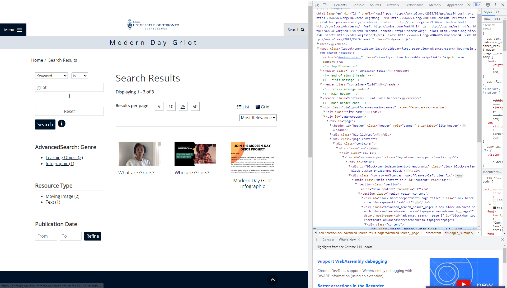

# Contributing to SiteWatch
SiteWatch is an open-source tool, and we welcome contributions from the community. This document outlines the process for contributing to SiteWatch.

## The SiteWatch Structure
SiteWatch is written in Python for readability and portability. The code structrue is as follows
### The `sitewatch` file
This file is the entry point for the application. It contains the logic for greeting and parsing command line arguments, verifying the config and CSV files, and looping over each test and initiating it. It also contains the logic for writing the results to the output file and initiating the email process. This file is the only file that should be run directly, and it has been setup to be an executable file. As this file is relatively short (all other logic is packed into other files), it shouldn't need to be modified often.

### The `utils` Directory
This directory contains various useful files with many utility functions. The `config_utils.py` module contains the logic for reading the config file and verifying that it is valid. The `csv_utils.py` module contains the logic for reading the CSV file and verifying that it is valid. The `email_utils.py` module contains the logic for sending emails. The documentation for the functions contained in these files is contained in the docstrings of the functions themselves, which makes it easy to use if you are editing the code in an IDE.

### The `test_suites` Directory
This directory contains logic for running tests. The main file to make note of here is `test_controller.py`, as this is the module which contains the `TestController` class, which can run tests given the name of the test and a CSV row. 

### The `pages` Directory
This directory contains logic for interacting with web pages. The main file to make note of here is `page.py`, as this is the module which contains the `BasePage` class, which is the base class for all pages (and it contains several useful functions applicable to all pages). When a page module is added to this directory, it should contain logic that is specific to that page. For example, the `collection_page.py` contains several functions that interact with viewers, which are specific to the collection page.

## Adding a New Test
To better illustrate the process of adding a new test, we will walk through the process of adding a test. Specifically, let's test the number of results when accessing a search page or a collections page. For example, on [this page](https://griot.digital.utsc.utoronto.ca/search-results?a%5B0%5D%5Bf%5D=all&a%5B0%5D%5Bi%5D=IS&a%5B0%5D%5Bv%5D=griot), there are 3 results, and on [this page](https://memory.digital.utsc.utoronto.ca/collection/33463), there are 23591 results. We want to design a test that compares the number of results on the page to the expected number of results that the user specifies in the CSV file, and fails if the numbers do not match.

There are several steps involved in adding a new test:
* Find an appropriate element to test
* Decide if you need a new page module and create one if necessary (must inherit from `BasePage`)
* In the page class you are testing, create logic to interact with the element you are testing
* Decide if you need a new test suite and create one if necessary (must inherit from `Test`)
* In the test suite, create a new test function with assert statements
* Add the test to the `test_controller.py` file
* Whitelist the test in the CSV checks

### Find an Appropriate Element to Test
Let's consider the [first page](https://griot.digital.utsc.utoronto.ca/search-results?a%5B0%5D%5Bf%5D=all&a%5B0%5D%5Bi%5D=IS&a%5B0%5D%5Bv%5D=griot) above. Here is a screenshot of the page


We want to confirm that there are 3 results on the page. First, ask yourself: "How would I, as a human, confirm that there are 3 results on the page?" You would probably look for something that says the total number of results. Indeed, find the element we are looking for


If we can get to the "3" part, then we'll know how many results we have.

We now use the Chrome DevTools to inspect this element and find something (like a class name, ID, XPath, or CSS selector) that we can use to identify this element, so that we can search for it in our code. To do this, right click on the element and click "Inspect". 


This will open the DevTools and highlight the element we are looking for in blue.




This is indeed the element we are looking for since it clearly says "Displaying 1 - 3 of 3". Now, we need to find something that we can use to identify this element. Typically, the following order for choosing what to identify the element by should be selected as follows:
* ID
* Class Name (if it is unique)
* XPath
* CSS Selector
We can see that the element has a class name of `pager__summary`, and this is unique to this element, so we will use this to identify the element. That's all we need from the webpage! We can close the entire browser if we want now.

### Decide if You Need a New Page Module and Create One if Necessary
At the time of writing, the only module in the `page` directory is `page.py`, and as that module contains logic for interacting with a general page, and this test pertains only to search and collections pages, we'll make a new module `collections_or_advanced_search_page.py`. 

### In the Page Class You Are Testing, Create Logic to Interact with the Element You Are Testing
We'll cut to the chase and show the code we wrote straight away, and then explain it.

```python
from pages.page import BasePage
from selenium.common.exceptions import NoSuchElementException
from selenium.webdriver.common.by import By
from typing import Optional

class CollectionsOrAdvancedSearchPage(BasePage):
    def get_collection_count(self) -> Optional[int]:
        """Return the number of collections on the collections page."""
        self.driver.get(self.url)
        try:
            pager_summary = self.driver.find_element(By.CLASS_NAME, "pager__summary")
            return int(pager_summary.text.split(" ")[-1])
        except NoSuchElementException:
            return None
```

As you can see, we have a class called `CollectionsOrAdvancedSearchPage` that inherits from `BasePage`. We have a function called `get_collection_count` that returns the number of collections on the page. This function does the following:
* Navigates to the page
* Finds the element we are looking for
* Gets the text of the element
* Splits the text by spaces
* Gets the last element of the list (which is the number of collections)
* Converts the number of collections to an integer
* Returns the number of collections

How does the function know which page to navigate to? The `BasePage` class has a constructor that takes in a URL (along with other parameters), and the `get_collection_count` function uses this URL to navigate to the page. See the `BasePage` class for more details.

### Decide if You Need a New Test Suite and Create One if Necessary
At the time of writing, the only module in the `test_suites` directory is `test.py`, and as that module contains only the abstract `Test` class, we'll make a new module `collection_count_test.py`.

### In the Test Suite, Create a New Test Function with Assert Statements
We'll cut to the chase and show the code we wrote straight away, and then explain it.

```python
from pages.collections_or_advanced_search_page import CollectionsOrAdvancedSearchPage
from test_suites.test import Test
from selenium.common.exceptions import NoSuchElementException

class CollectionCountTest(Test):
    """ A test to check that the number of collections on the collections page is correct. """    
    def run(self, url: str, expected_value: str) -> None:
        """ Run the test on the page at <url> and compare the result to <expected_value>."""
        try:
            expected_value = int(expected_value)
        except ValueError:
            raise ValueError(f"Expected value must be an integer, but got {expected_value}.")
        collection_page = CollectionsOrAdvancedSearchPage(self.driver, url)
        try:
            actual_value = int(collection_page.get_collection_count())
        except NoSuchElementException:
            raise NoSuchElementException(f"Could not find the collections count on {url}.")
        assert actual_value == expected_value, f"Expected {expected_value}, but got {actual_value}."
```

As you can see, we have a class called `CollectionCountTest` that inherits from `Test`. We have a function called `run` that runs the test. This function does the following:
* Tries to convert the expected value to an integer
* Creates a `CollectionsOrAdvancedSearchPage` object
* Tries to get the number of collections on the page
* Asserts that the actual value is equal to the expected value

### Add the Test to the `test_controller.py` File
This itself contains multiple steps:
* Import the test suite
* Make an attribute for the `TestController` that points to an instance of your new test suite
* Make a function that runs your test suite
* Add your test to the `TestController`'s `run_test` function

We'll first import test suite: 
```python
from test_suites.collection_count_test import CollectionCountTest
```

Then, we'll add the following line to the bottom of the initializer of the `TestController` class:

```python
self.collection_count_test = CollectionCountTest(self.driver)
```
So now the initializer looks like this:

```python
class TestController():
    def __init__(self):
        options = webdriver.ChromeOptions()
        options.add_argument("--headless")
        self.driver.implicitly_wait(20)
        self.driver = webdriver.Chrome(options=options)
        self.collection_count_test = CollectionCountTest(self.driver)
```

Then, we'll make a function that runs the test suite:
```python
def run_collection_count_test(self, csv_row: dict, csv_row_number: int) -> bool:
        """ Runs a Collection Count Test. """
        try:
            self.collection_count_test.run(csv_row["url"], csv_row["test_input"])
        except ValueError:
            print(Fore.RED, f"Invalid test input on row {csv_row_number + 1}. Please see log for more details.")
            logging.error(f"Invalid test input on row {csv_row_number + 1}. The test input must be an integer.")
            return False
        except AssertionError as e:
            # Get the assertion error message
            error_message = str(e)
            print(Fore.RED, f"Collection Count Test failed on row {csv_row_number + 1}. Please see log for more details.")
            logging.error(f"Collection Count Test failed on row {csv_row_number + 1}. The expected number of collections was not found. {error_message}")
            return False
        except Exception as e:
            print(Fore.RED, f"Collection Count Test failed on row {csv_row_number + 1}. Please see log for more details.")
            logging.error(f"Collection Count Test failed on row {csv_row_number + 1}. {e}")
            return False
        else:
            print(Fore.GREEN, f"Collection Count Test passed on row {csv_row_number + 1}.")
            logging.info(f"Collection Count Test passed on row {csv_row_number + 1}.")
            return True
```
We must make sure that under no circumstances does the test suite crash, so we have a try-except block that catches all exceptions. If the test passes, we print a green message to the console and log a message to the log file. If the test fails, we print a red message to the console and log a message to the log file.

Finally, we'll add the following line to the `run_test` function:
```python
if test_type == 'collection_count_test':
    test_result = self.run_collection_count_test(csv_row, csv_row_number)
```

### Whitelist the Test in the CSV Checks
Go to `csv_utils.py` and find the `check_data` function. There will be a variable `supported_test_types` that contains a list of all the test types that are supported. Add your test type to this list. We'll just add a new element `collection_count_test' to the list.

And that's it! You've added a new test to the test suite. Now, you can run the test suite and see if it works. If it doesn't, you can debug it and fix it.