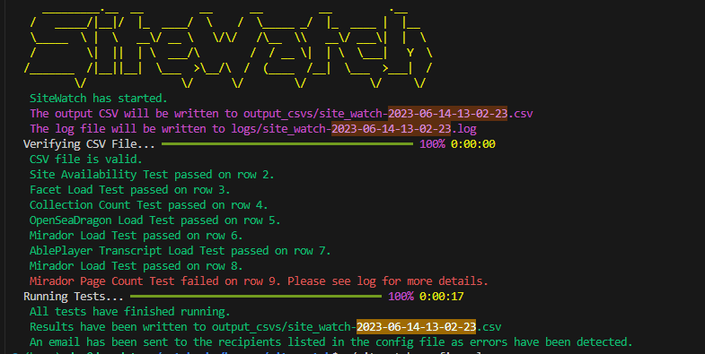

# Output In SiteWatch
Sitewatch has the capability to convey the results of its tests in a variety of ways:

* To the console (stdout)
* To a log file
* To a CSV file
* To email addresses

The first three of these are by default enabled, and the last is up to the user to enable. The following sections describe each of these in detail.

## Console Output
SiteWatch provides a nice, human-readable summary of its results to the console. Here is an example of what that looks like:




## Log File
SiteWatch writes a log file to the `logs` directory. The name of the file is time-stamped to be unique. The name of the log file is the same as the name of the output CSV file (see below), but with a `.log` extension. For example, if the output CSV file is named `site_watch-2023-06-14-13-02-23.csv`, the log file will be named `site_watch-2023-06-14-13-02-23.log`. The log file serves to report important information about the results of tests and, if they failed, why they failed. Here is an example of what the log file for the above console output might look like:
```text
INFO:root:SiteWatch has started.
INFO:utils.csv_utils:CSV file is valid.
INFO:test_suites.test_controller:Site Availability Test passed on row 2.
INFO:test_suites.test_controller:Collection Count Test passed on row 3.
INFO:test_suites.test_controller:OpenSeaDragon Load Test passed on row 4.
INFO:test_suites.test_controller:Mirador Load Test passed on row 5.
INFO:test_suites.test_controller:AblePlayer Transcript Load Test passed on row 6.
INFO:test_suites.test_controller:Mirador Load Test passed on row 7.
ERROR:test_suites.test_controller:Mirador Page Count Test failed on row 8. Mirador viewer does not have the expected number of thumbnails. Expected 1032, got 1034.
INFO:root:All tests have finished running.
INFO:root:Results have been written to output_csvs/site_watch-2023-06-14-13-02-23.csv
```


## Output CSV
SiteWatch writes a CSV file to the `output_csvs` directory. The name of the file is time-stamped to be unique. The name of the output CSV file is the same as the name of the log file (see above), but with a `.csv` extension. For example, if the log file is named `site_watch-2023-06-14-13-02-23.log`, the output CSV file will be named `site_watch-2023-06-14-13-02-23.csv`. The output CSV is a copy of the input test data file, but with two columns appended:
 
* `test_result`: The result of the test. This will be either `Passed` or `Failed`.
* `total_time`: The total time it took to run the test, in seconds.
For example, if the original input data file looked like
```csv
url,test_type,input_data
https://memory.digital.utsc.utoronto.ca/collection/33463,collection_count_test,23591
```
the output CSV file would look like
```csv
url,test_type,input_data,test_result,total_time
https://memory.digital.utsc.utoronto.ca/collection/33463,collection_count_test,23591,Passed,0.5
```


## Email
SiteWatch has the capability to send an email to one or more email addresses when it finishes running, only in the event of error or failed test case. This is useful for notifying people when a test has failed. The email sent will contain a copy of the log and output CSV files. To enable this feature, see [Email Settings](configuration.md#email-settings).

